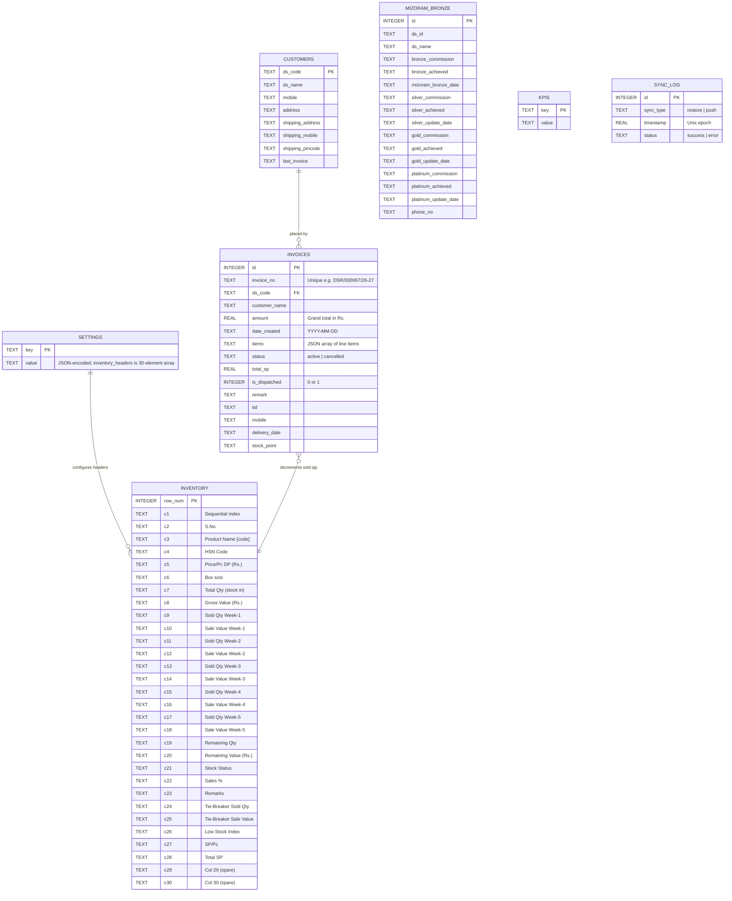
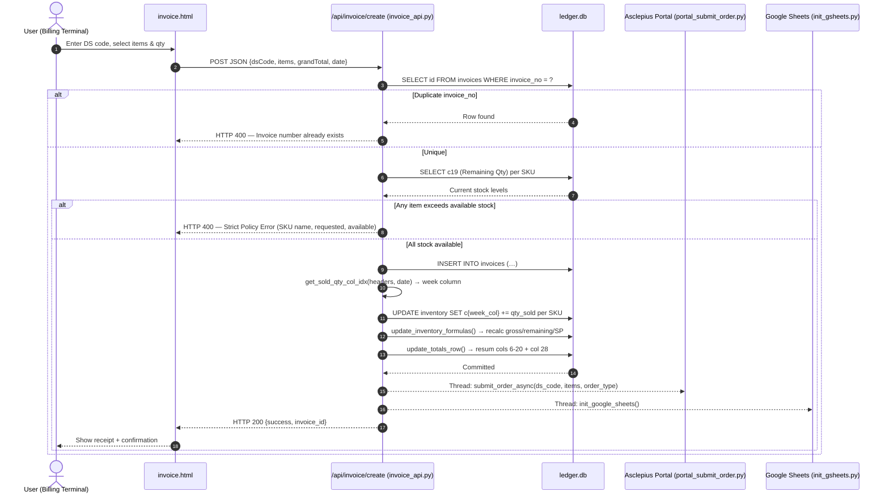
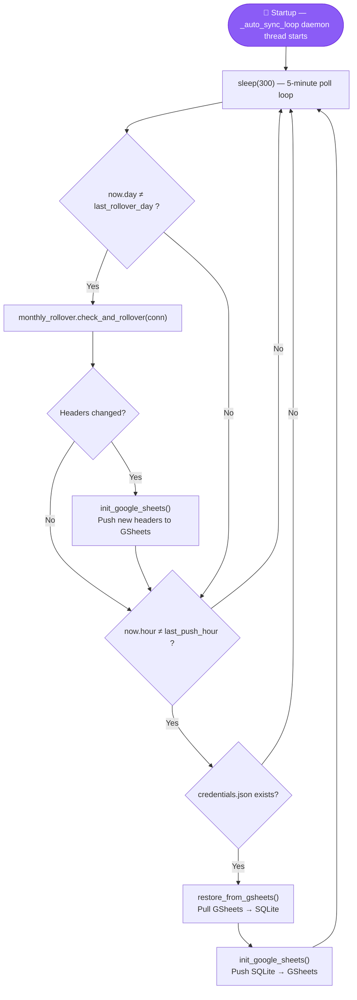
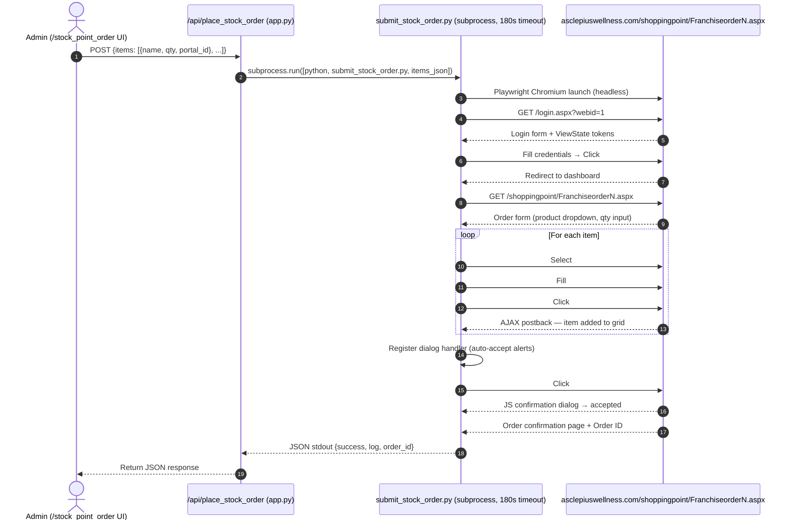
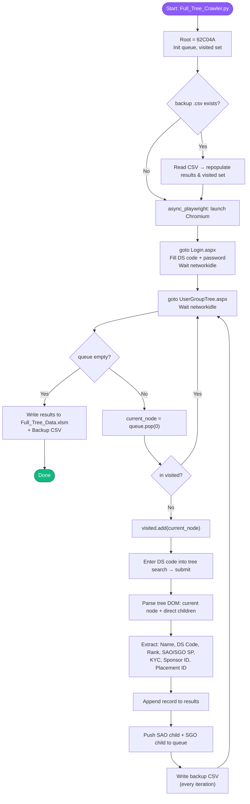
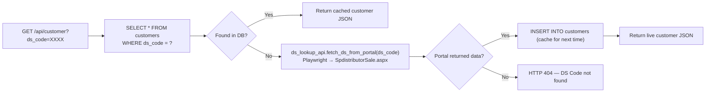
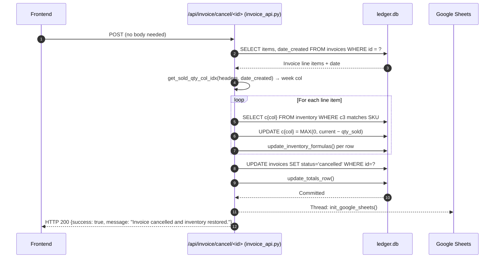
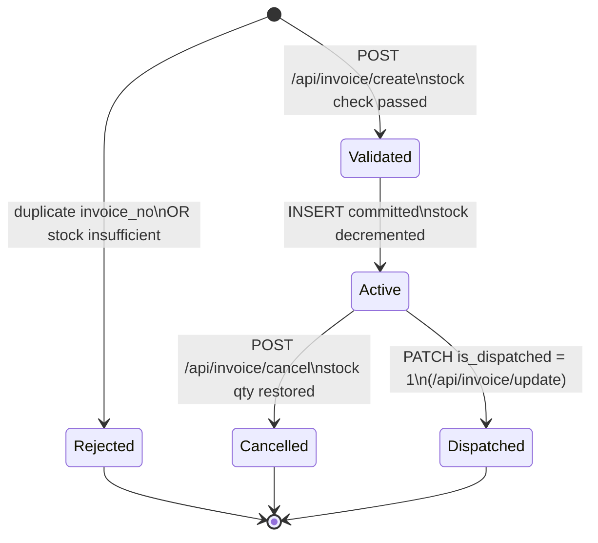

# 🏗️ Deep System Architecture & How It Works

> **Ledger God Mode Web App**  
> A real-time distributor ERP — inventory engine, invoice terminal, automated MLM downline crawler, portal robotics, and Google Sheets cloud sync.  
> Stack: **Python 3.11 · Flask 3.0.3 · Playwright 1.44 · gspread 6.2.1 · SQLite3 · Gunicorn 22 · Docker**

---

## 📑 Table of Contents

1. [High-Level Architecture Overview](#1-high-level-architecture-overview)
2. [System Topology Graph (Graphify)](#2-system-topology-graph-graphify)
3. [Core Subsystems & Module Breakdown](#3-core-subsystems--module-breakdown)
4. [Database Schema & ERD](#4-database-schema--erd)
5. [Sequence Diagrams & Data Flows](#5-sequence-diagrams--data-flows)
   - [5.1 Invoice Creation & Strict Stock Depletion](#51-invoice-creation--strict-stock-depletion)
   - [5.2 Auto-Sync Scheduler — Hourly GSheets + Daily Rollover](#52-auto-sync-scheduler--hourly-gsheets--daily-rollover)
   - [5.3 Stock Point Order via Headless Portal Bot](#53-stock-point-order-via-headless-portal-bot)
   - [5.4 BFS Genealogy Downline Tree Crawler](#54-bfs-genealogy-downline-tree-crawler)
   - [5.5 Customer DS Lookup — DB Cache + Live Portal Fallback](#55-customer-ds-lookup--db-cache--live-portal-fallback)
   - [5.6 Invoice Cancel & Stock Restoration](#56-invoice-cancel--stock-restoration)
6. [Invoice State Machine](#6-invoice-state-machine)
7. [Auto-Sync Background Scheduler](#7-auto-sync-background-scheduler)
8. [Security, Concurrency & Resiliency](#8-security-concurrency--resiliency)
9. [Full API Route Directory](#9-full-api-route-directory)

---

## 1. High-Level Architecture Overview

The application is a **monolithic Flask server** that exposes both a browser-based multi-page dashboard and a REST API. It manages:

1. **Inventory Accounting** — 220+ product SKUs with 30 dynamic columns, 5 weekly sales buckets per month, and automatic formula recalculation (gross value, remaining qty/value, SP totals).
2. **Invoice Billing Terminal** — DS code auto-lookup via local DB + live portal fallback (`ds_lookup_api.py`), strict pre-commit stock validation, and automatic order submission to the Asclepius portal (`portal_submit_order.py`).
3. **Monthly Auto-Rollover** — Background daemon (`_auto_sync_loop`) checks every 5 minutes; rolls inventory column headers to the new month once per calendar day; pushes to GSheets every hour.
4. **Portal Robotics** — Playwright Chromium (headless) submits franchise restock orders and fetches DS sale reports from `asclepiuswellness.com`.
5. **MLM Downline Crawler** — Async BFS/DFS traversal of the full genealogy tree starting from root node `62C04A`, with CSV checkpointing.
6. **Cloud Sync** — Bidirectional Google Sheets (via `gspread` Service Account) at startup + every hour + on every mutation.

---

## 2. System Topology Graph (Graphify)

```mermaid
graph TB
    subgraph Client_Layer ["🖥️ Client & Interface Tier"]
        UI_Dash["📊 Dashboard\n/dashboard"]
        UI_Inv["📦 Live Inventory\n/inventory"]
        UI_Master["📈 Inventory Master\n/inventory_master"]
        UI_Invoice["🧾 Billing Terminal\n/invoice"]
        UI_InvHist["📜 Invoice History\n/invoice_history"]
        UI_PurHist["🚚 Purchase History\n/purchase_history"]
        UI_Ledger["💰 Financial Ledger\n/ledger_report"]
        UI_Mizoram["🏆 Mizoram Bronze\n/mizoram_bronze"]
        UI_Disease["🌿 Disease Guide\n/disease_guide"]
        UI_SPOrder["🛒 Stock Point Order\n/stock_point_order"]
        UI_Portal["🔄 Portal Sync\n/portal_sync"]
    end

    subgraph Flask_Core ["⚙️ Flask Application Core (app.py)"]
        Router["REST Router + Blueprints"]
        AutoSync["🔁 AutoSync Daemon\n_auto_sync_loop\nevery 5-min poll\nhourly GSheets\ndaily rollover"]
        ErrHandler["🛡️ Error Handlers 400/404/405/500"]
    end

    subgraph Blueprints ["🔌 Flask Blueprints"]
        BP_Invoice["invoice_api.py Blueprint\n/api/invoice/*"]
    end

    subgraph Engines ["🧮 Computation & Business Logic"]
        InvEngine["inventory_engine.py\nDynamic 5-week bucket calc\n220 SKUs × 30 columns"]
        MonthRoll["monthly_rollover.py\nDetects month change\nZeroes sold-qty cols\nRe-sums TOTAL row"]
        DisEngine["Disease Guide Cache\n_DISEASE_CACHE\nThread-safe singleton\n100+ conditions"]
        InvFormulas["update_inventory_formulas()\nGross Value\nRemaining Qty/Value\nSales % · SP Total"]
    end

    subgraph GSheets_Sync ["☁️ Google Sheets Sync (gspread)"]
        RestoreGS["restore_gsheets.py\nPull: GSheets → SQLite\nCustomers / Inventory\nInvoices / Settings\n60-sec rate-limit"]
        InitGS["init_gsheets.py\nPush: SQLite → GSheets\nAll tables + headers\nTriggered on every mutation"]
    end

    subgraph Portal_Automation ["🤖 Portal Automation (Playwright)"]
        PortalSubmit["portal_submit_order.py\nSAO/SGO order submit\nto SpdistributorSale.aspx\nAsync thread spawn"]
        StockOrder["submit_stock_order.py\nFranchise restock order\nFranchiseorderN.aspx\nSubprocess call"]
        DSLookup["ds_lookup_api.py\nLive DS lookup\nSpdistributorSale.aspx\nFallback if not in DB"]
        PortalSync["portal_sync.py\nFetch DS Sale Report\nspDSSaleReport.aspx\n(Currently disabled in API)"]
        LedgerScrape["fetch_ledger_report.py\nScrape wallet ledger\nSubprocess Popen"]
    end

    subgraph Crawlers ["🌲 Downline Crawlers"]
        FullCrawler["Full_Tree_Crawler.py\nBFS from 62C04A\nAsync Playwright\nCSV checkpoint"]
        ParallelCrawler["Parallel_Tree_Crawler.py\nMulti-thread BFS\nSAO + SGO trees"]
        SGOCrawler["SGO_Tree_Crawler.py\nSGO subtree only"]
    end

    subgraph Persistence ["🗄️ Persistence Layer"]
        DB[("ledger.db\nSQLite3")]
        T_Inv["inventory\n220 rows × 30 cols (c1-c30)"]
        T_Invoices["invoices\n149+ records"]
        T_Cust["customers\n58 DS codes"]
        T_Mizoram["mizoram_bronze\nBronze/Silver/Gold/Platinum"]
        T_KPI["kpis"]
        T_Settings["settings\ninventory_headers JSON"]
        T_SyncLog["sync_log"]
        JSON_PO["purchase_orders.json\nSupplier challan history"]
        JSON_Disease["master_review_data_perfected.json\nDisease catalog"]
        JSON_Products["scraped_products.json\nPortal product catalog"]
        JSON_Ledger["ledger_report.json\nWallet statement cache"]
    end

    subgraph External ["🌐 External Services"]
        AWPL["asclepiuswellness.com\nASP.NET Portal"]
        GCloud["Google Sheets API v4\ngspread Service Account"]
        Render["Render.com\ndashboard-modern-ledger-4-1"]
        UptimeBot["UptimeRobot\n5-min /ping heartbeat"]
    end

    %% Client → Flask
    UI_Dash & UI_Inv & UI_Master & UI_InvHist & UI_PurHist & UI_Ledger & UI_Mizoram & UI_Disease & UI_SPOrder & UI_Portal --> Router
    UI_Invoice --> BP_Invoice

    %% Flask → Engines
    Router --> InvEngine
    Router --> MonthRoll
    Router --> DisEngine
    Router --> InvFormulas
    Router --> RestoreGS
    Router --> InitGS
    Router --> StockOrder
    Router --> DSLookup
    Router --> LedgerScrape
    BP_Invoice --> InvEngine
    BP_Invoice --> InvFormulas
    BP_Invoice --> DSLookup
    BP_Invoice --> PortalSubmit
    BP_Invoice --> InitGS

    %% AutoSync
    AutoSync --> MonthRoll
    AutoSync --> RestoreGS
    AutoSync --> InitGS

    %% Engines → DB
    InvEngine --> DB
    MonthRoll --> DB
    InvFormulas --> DB
    BP_Invoice --> DB
    RestoreGS --> DB
    InitGS --> DB
    Router --> DB

    %% DB tables
    DB --- T_Inv & T_Invoices & T_Cust & T_Mizoram & T_KPI & T_Settings & T_SyncLog

    %% Portal → External
    PortalSubmit --> AWPL
    StockOrder --> AWPL
    DSLookup --> AWPL
    PortalSync --> AWPL
    LedgerScrape --> AWPL
    FullCrawler & ParallelCrawler & SGOCrawler --> AWPL

    %% GSheets ↔ External
    RestoreGS <-->|bidirectional| GCloud
    InitGS --> GCloud

    %% Keep-alive
    UptimeBot -->|GET /ping every 5 min| Render

    classDef ui fill:#3b82f6,stroke:#1d4ed8,color:#fff;
    classDef server fill:#8b5cf6,stroke:#6d28d9,color:#fff;
    classDef engine fill:#10b981,stroke:#047857,color:#fff;
    classDef cloud fill:#06b6d4,stroke:#0891b2,color:#fff;
    classDef bot fill:#f59e0b,stroke:#d97706,color:#fff;
    classDef db fill:#ef4444,stroke:#b91c1c,color:#fff;
    classDef ext fill:#64748b,stroke:#334155,color:#fff;

    class UI_Dash,UI_Inv,UI_Master,UI_Invoice,UI_InvHist,UI_PurHist,UI_Ledger,UI_Mizoram,UI_Disease,UI_SPOrder,UI_Portal ui;
    class Router,AutoSync,ErrHandler,BP_Invoice server;
    class InvEngine,MonthRoll,DisEngine,InvFormulas engine;
    class RestoreGS,InitGS cloud;
    class PortalSubmit,StockOrder,DSLookup,PortalSync,LedgerScrape,FullCrawler,ParallelCrawler,SGOCrawler bot;
    class DB,T_Inv,T_Invoices,T_Cust,T_Mizoram,T_KPI,T_Settings,T_SyncLog,JSON_PO,JSON_Disease,JSON_Products,JSON_Ledger db;
    class AWPL,GCloud,Render,UptimeBot ext;
```

---

## 3. Core Subsystems & Module Breakdown

### 3.1 Flask Application Core (`app.py` — 1373 lines)
- **Framework**: Flask 3.0.3 + Jinja2 · Served by **Gunicorn 22** with `--timeout 300`.
- **Python**: 3.11.0 (specified in `render.yaml`).
- **Encoding**: `JSON_AS_ASCII = False` — proper UTF-8 (₹, Devanagari, etc.).
- **Health endpoints**: `/ping` and `/health` → `{"status":"ok"}` — polled every 5 minutes by UptimeRobot to prevent Render free-tier cold starts.
- **Blueprint**: `invoice_api.py` registered at startup via `app.register_blueprint(invoice_api)`.
- **Startup sequence**:
  1. If `credentials.json` exists → `restore_from_gsheets()` (pull cloud → local).
  2. `monthly_rollover.check_and_rollover()` — roll headers if month changed.
  3. Launch perpetual daemon thread `_auto_sync_loop`.
- **Background scheduler** (`_auto_sync_loop`): polls every **5 minutes**, runs rollover check once per calendar day, pushes/pulls GSheets once per hour.

### 3.2 Dynamic Inventory Engine (`inventory_engine.py`)
- Builds 5 weekly sales buckets dynamically for **any** target month:

| Week | Day Range |
|------|-----------|
| W1 | 1 – 7 |
| W2 | 8 – 14 |
| W3 | 15 – 21 |
| W4 | 22 – 28 |
| W5 | 29 – (28/29/30/31) |

- **Formulas computed**:
  - `Gross Value = Total Qty × Price/Pc`
  - `Remaining Qty = Total Purchased − Σ Cumulative Sales`
  - `Remaining Value = Remaining Qty × Price/Pc`
  - `Sales % = (Sold Qty / Total Qty) × 100`
  - `Total SP = Remaining Qty × SP/Pc`

- Purchases sourced from `purchase_orders.json`; sales from `invoices` table (excluding `status='cancelled'`).

### 3.3 Monthly Rollover (`monthly_rollover.py`)
- Reads the month embedded in the `Sold Qty (Mon DD-DD)` column headers from `settings.inventory_headers`.
- If the stored month ≠ current month: renames all 5 Sold Qty + Sale Value column headers to the new month, **zeroes** all sold-qty cells for the new month's columns, re-sums the `TOTAL` row.
- Triggered at startup AND once per calendar day from `_auto_sync_loop`.

### 3.4 Invoice & Strict Stock Depletion API (`invoice_api.py` — Blueprint)
**Endpoints registered under `invoice_api` Blueprint:**

| Route | Method | Purpose |
|---|---|---|
| `/api/invoice/create` | POST | Create invoice (full validation pipeline) |
| `/api/invoice/list` | GET | List all invoices with SP recalculation |
| `/api/invoice/update/<id>` | POST | Update is_dispatched / remark fields |
| `/api/invoice/next_no` | GET | Auto-generate next DSR/XXXXXX/YY-ZZ invoice number |
| `/api/invoice/cancel/<id>` | POST | Cancel invoice + restore stock quantities |
| `/api/invoice/sync_sheets` | POST | Trigger GSheets sync manually |

**Invoice creation pipeline (strict, atomic):**
1. Duplicate `invoice_no` check → reject if exists.
2. Aggregate requested SKU quantities by normalized name.
3. Compare vs. live `c19` (Remaining Qty) → reject if any item exceeds stock.
4. `INSERT INTO invoices` with all fields.
5. Find the correct week bucket column for the invoice date via `get_sold_qty_col_idx()`.
6. `UPDATE inventory` — add to sold qty column.
7. `update_inventory_formulas()` — recalculate gross, remaining, values, SP.
8. `update_totals_row()` — resum the TOTAL row (cols 6–20 + col 28).
9. Spawn daemon thread → `portal_submit_order.submit_order_async()` (SAO/SGO portal order).
10. Spawn daemon thread → `init_google_sheets()` (cloud backup).

**Invoice cancel restores sold qty** by subtracting from the correct week column (same `get_sold_qty_col_idx()` logic) and re-running formulas.

### 3.5 Customer Lookup — DB Cache + Live Portal Fallback (`/api/customer`)
- First queries `customers` table by `ds_code`.
- If not found, calls `ds_lookup_api.fetch_ds_from_portal(ds_code)` — Playwright headless session to `SpdistributorSale.aspx`, scrapes name, mobile, address, shipping details.
- Auto-saves result to `customers` table for future hits (no repeat scraping).

### 3.6 Portal Robotic Automation
| Module | Target URL | Purpose |
|---|---|---|
| `portal_submit_order.py` | `SpdistributorSale.aspx` | Submit SAO/SGO sale order after billing; supports radio-button SAO/SGO selection |
| `submit_stock_order.py` | `FranchiseorderN.aspx` | Submit franchise restock purchase order; called as **subprocess** from `/api/place_stock_order` with 3-min timeout |
| `ds_lookup_api.py` | `SpdistributorSale.aspx` | Live DS code name/address lookup; called when customer not in local DB |
| `portal_sync.py` | `spDSSaleReport.aspx` | Fetch DS Sale Report for a date range; **NOTE: `/api/portal_sync` is currently disabled** (returns 501, pending SQLite migration) |
| `fetch_ledger_report.py` | Portal ledger pages | Scrape wallet transaction statements; launched as `subprocess.Popen` |

### 3.7 Google Sheets Bidirectional Sync
- **Library**: `gspread 6.2.1` with Service Account credentials from `credentials.json` or `/etc/secrets/credentials.json`.
- **Sheet Name**: `Ledger_Database`.
- **Worksheets synced**: `Customers`, `Inventory`, `Invoices`, `Settings`.
- **`restore_from_gsheets()`**: Pulls cloud → SQLite; rate-limited to max once per 60 seconds; logs to `sync_log`.
- **`init_google_sheets()`**: Pushes SQLite → GSheets; triggered on every create/update/cancel/restock/rollover mutation.
- **Hourly sync**: Pull then push, managed by `_auto_sync_loop` background daemon.

### 3.8 Genealogy Downline Crawlers
| Module | Mode | Details |
|---|---|---|
| `Full_Tree_Crawler.py` | Async BFS | Root `62C04A`; both SAO + SGO binary subtrees; CSV checkpoint every iteration |
| `Parallel_Tree_Crawler.py` | Multi-thread BFS | Parallel extraction; faster for large trees |
| `SGO_Tree_Crawler.py` | Async BFS | SGO subtree only |

All crawlers authenticate to `https://asclepiuswellness.com/userpanel/UserGroupTree.aspx` and extract: DS Code, Name, Rank, Left/Right SP, KYC status, Sponsor ID, Placement ID.

### 3.9 Disease Guide (`/disease_guide` + `/api/disease_guide`)
- JSON source: `static/master_review_data_perfected.json`.
- **Thread-safe singleton cache** (`_DISEASE_CACHE` + `threading.Lock`), loaded once on first request.
- Fields indexed: disease name, category, recommended products, diet, exercise, Ayurvedic tips, things to avoid, disclaimer.
- API supports: `?q=<term>` (substring search) and `?category=<name>` (exact match).

### 3.10 KPI Dashboard (`/api/kpi`)
Live-computed KPIs directly from DB + `ledger_report.json`:
- Total SKUs, Remaining Qty, Remaining Value, Gross Stock Value (= total Dr entries in ledger)
- Initial Capital (first Cr entry), Sales Recycled (subsequent Cr entries), Wallet Balance
- Monthly Sales Value (current month), Week Sales Value (last 7 days)
- Total Invoices, Total Invoice Value, Low Stock Count, Out of Stock Count

---

## 4. Database Schema & ERD

---

## 5. Sequence Diagrams & Data Flows

### 5.1 Invoice Creation & Strict Stock Depletion

---

### 5.2 Auto-Sync Scheduler — Hourly GSheets + Daily Rollover

---

### 5.3 Stock Point Order via Headless Portal Bot

---

### 5.4 BFS Genealogy Downline Tree Crawler

---

### 5.5 Customer DS Lookup — DB Cache + Live Portal Fallback

---

### 5.6 Invoice Cancel & Stock Restoration

---

## 6. Invoice State Machine

---

## 7. Auto-Sync Background Scheduler

The `_auto_sync_loop` daemon (started at app startup, never stops) implements this schedule:

| Interval | Action |
|---|---|
| Every 5 minutes | Wake up and check day/hour |
| Once per calendar **day** | `monthly_rollover.check_and_rollover()` — if month changed: rename headers, zero new-month sold cols, resum TOTAL row, then push to GSheets |
| Once per calendar **hour** | If `credentials.json` present: `restore_from_gsheets()` (pull) then `init_google_sheets()` (push) |

---

## 8. Security, Concurrency & Resiliency

| Concern | Implementation |
|---|---|
| **Thread safety** | New SQLite connection per request (`get_db()`); no shared connection state |
| **Stock oversell prevention** | Pre-commit stock check in `create_invoice()` — rejects entire transaction if any SKU is short |
| **Portal rate limits** | `ds_lookup_api` caches results in `customers` table; `restore_from_gsheets` enforces 60-sec rate limit via `sync_log` |
| **Subprocess isolation** | `submit_stock_order.py` and `fetch_ledger_report.py` run as subprocesses (Playwright can block Gunicorn workers) |
| **Auto-recovery** | BFS crawlers checkpoint to CSV every node; resume automatically if interrupted |
| **Cloud portability** | Credentials loaded from `/etc/secrets/credentials.json` (Render Secret Files) or local `credentials.json` |
| **Portal sync disabled** | `/api/portal_sync` returns HTTP 501 intentionally — pending SQLite migration of the sync engine |

---

## 9. Full API Route Directory

### `app.py` routes

| Endpoint | Method | Description |
|---|---|---|
| `/`, `/dashboard` | GET | Main dashboard SPA |
| `/inventory` | GET | Live inventory page |
| `/inventory_master` | GET | Multi-month inventory master |
| `/invoice` | GET | Invoice creation terminal |
| `/invoice_history` | GET | Invoice history viewer |
| `/purchase_history` | GET | Purchase orders log |
| `/ledger_report` | GET | Financial ledger / wallet |
| `/stock_point_order` | GET | Franchise restock order UI |
| `/mizoram_bronze` | GET | Mizoram target tracker |
| `/disease_guide` | GET | Ayurvedic disease guide |
| `/portal_sync` | GET | Portal sync management UI |
| `/health`, `/ping` | GET | Health probe → `{"status":"ok"}` |
| `/api/disease_guide` | GET | Disease search `?q=` `?category=` |
| `/api/disease_guide/<idx>` | GET | Full disease detail by index |
| `/api/kpi` | GET | Live KPI dashboard metrics |
| `/api/inventory` | GET | Inventory data + headers |
| `/api/inventory/restock` | POST | Add stock qty to a product |
| `/api/inventory/add_product` | POST | Add a new product SKU |
| `/api/stock_point_inventory` | GET | Portal product catalog (scraped_products.json) |
| `/api/inventory_master/months` | GET | List all available months |
| `/api/inventory_master` | GET | Compute monthly inventory grid `?month=YYYY-MM` |
| `/api/inventory_master/update` | POST | Update a single inventory cell |
| `/api/product/purchases` | GET | Purchase history for a product |
| `/api/product/sales` | GET | Sales history for a product |
| `/api/submit_order` | POST | Bulk inventory cell updates |
| `/api/customer` | GET | DS code lookup (DB cache → portal fallback) |
| `/api/purchase_orders` | GET | Full purchase_orders.json contents |
| `/api/kpi` | GET | Live KPIs from DB + ledger |
| `/api/force_sync` | GET | Force pull from GSheets |
| `/api/sync_now` | POST/GET | Manual full pull+rollover+push cycle |
| `/api/fix_sync` | GET | Run robust_sync.sync_all_to_inventory() |
| `/api/sync_remarks_from_gsheets` | POST | Pull remarks column only from GSheets |
| `/api/mizoram_bronze` | GET | Get all Mizoram Bronze records |
| `/api/mizoram_bronze/update` | POST | Update a field in a Mizoram record |
| `/api/sync_mizoram_now` | POST | Trigger live Mizoram data sync |
| `/api/fix_historical_buckets` | POST | Run fix_buckets.py as subprocess |
| `/api/ledger_report` | GET | Return ledger_report.json contents |
| `/api/ledger_wallet_balance` | GET | Return closing balance only |
| `/api/sync_ledger` | POST | Launch fetch_ledger_report.py (Popen) |
| `/api/sync_status` | GET | Check ledger scraper subprocess status |
| `/api/ledger_manual_entry` | POST | Append a manual debit/credit entry |
| `/api/place_stock_order` | POST | Run submit_stock_order.py subprocess (3-min timeout) |
| `/api/sp_order_data` | GET | Fetch live SP order data (25-sec timeout) |
| `/api/portal_sync` | POST | **Disabled — HTTP 501** (pending SQLite migration) |

### `invoice_api.py` Blueprint routes

| Endpoint | Method | Description |
|---|---|---|
| `/api/invoice/create` | POST | Create invoice + validate stock + update inventory |
| `/api/invoice/list` | GET | List all invoices with SP recalculation |
| `/api/invoice/update/<id>` | POST | Update dispatch status / remark |
| `/api/invoice/next_no` | GET | Auto-generate next DSR invoice number |
| `/api/invoice/cancel/<id>` | POST | Cancel invoice + restore inventory stock |
| `/api/invoice/sync_sheets` | POST | Trigger init_google_sheets() manually |

---

*Last verified against source: `app.py` (1373 lines), `invoice_api.py` (484 lines), `inventory_engine.py` (363 lines), `monthly_rollover.py` (152 lines).*
