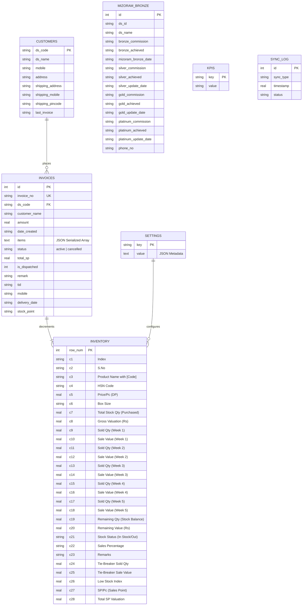
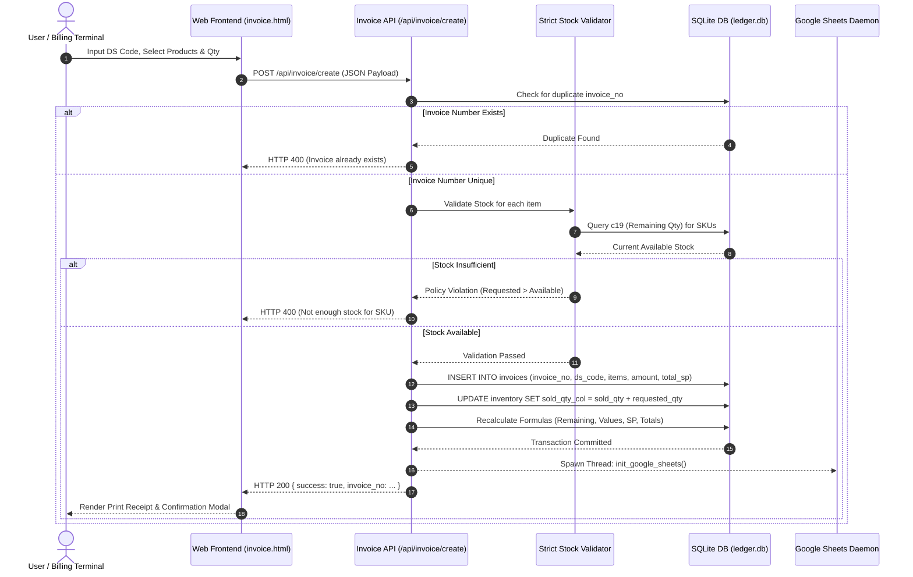
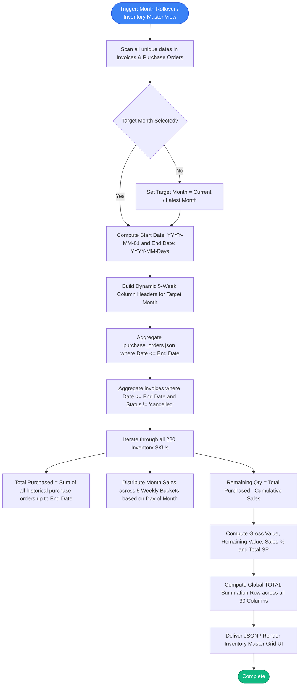
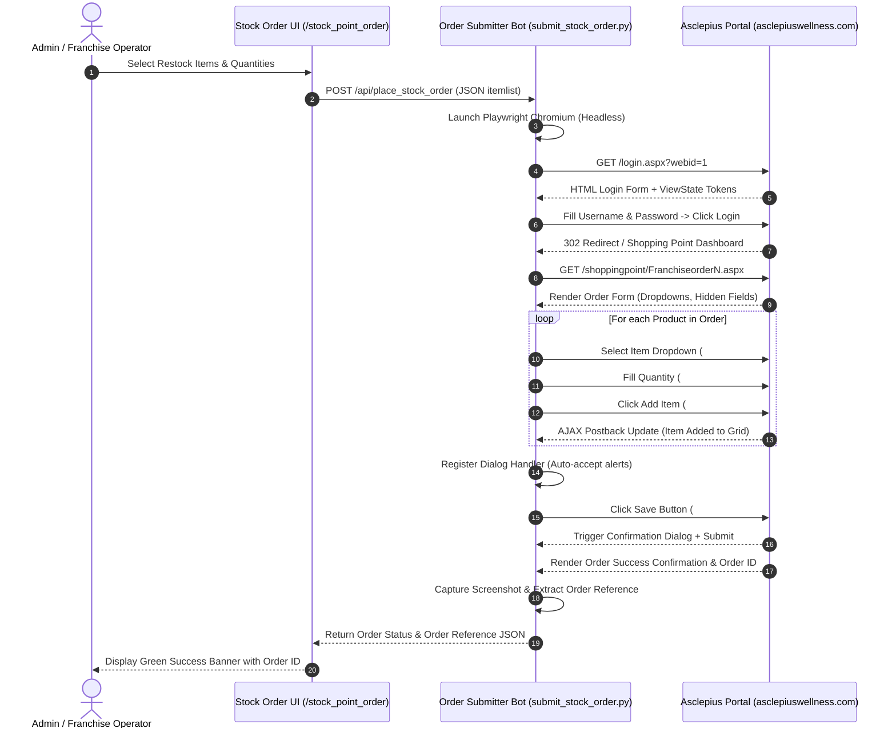
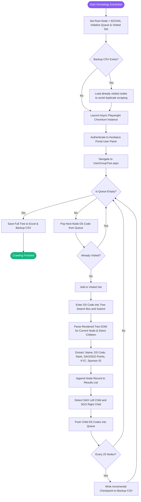
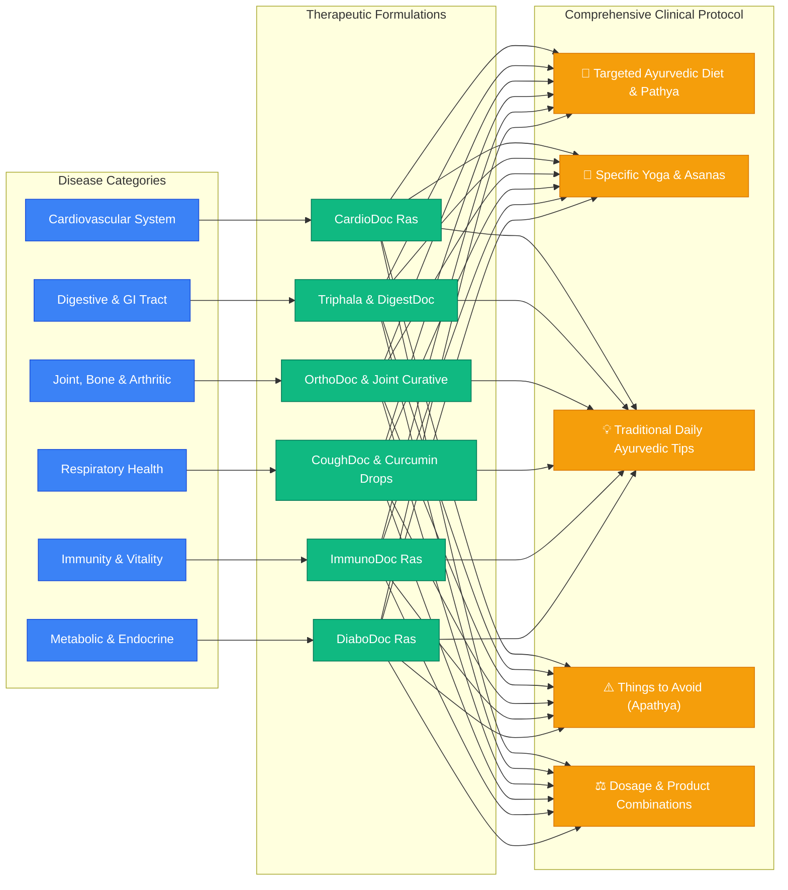
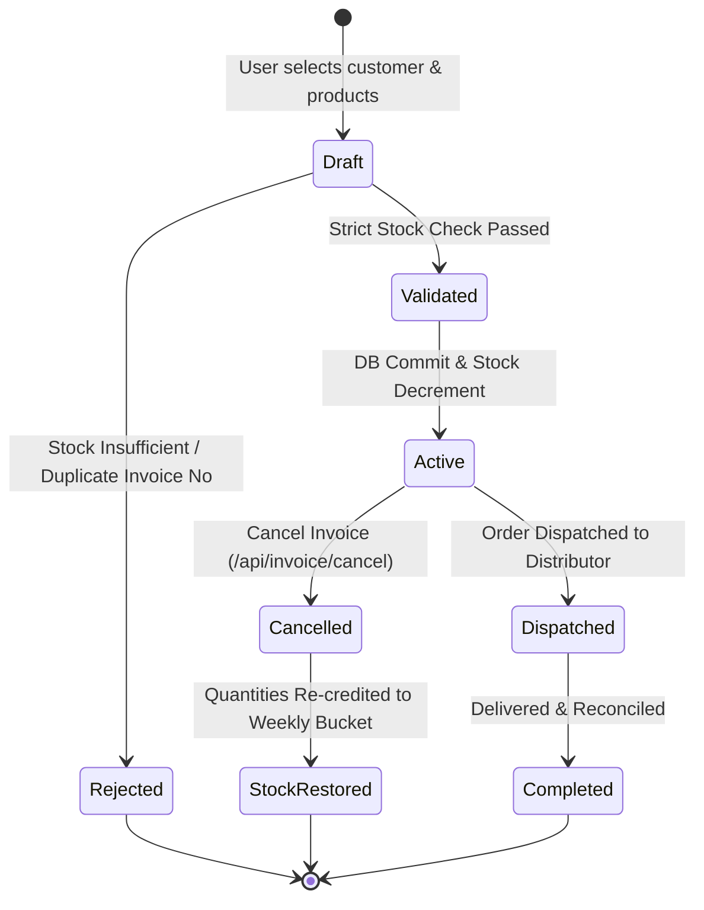

# 🏗️ Deep System Architecture & Technical Specifications

> **Ledger Web App (God Mode Architecture)**  
> High-performance ERP, Real-Time Dynamic Inventory Engine, Automated MLM Downline Crawler Grid, and Multi-Cloud Synchronization System.

---

## 📑 Table of Contents

1. [High-Level Architectural Overview](#1-high-level-architectural-overview)
2. [Visual Component Graph (Graphify Topology)](#2-visual-component-graph-graphify-topology)
3. [Core Subsystems & Module Breakdown](#3-core-subsystems--module-breakdown)
   - [3.1 Web Application & REST API Gateway (`app.py`)](#31-web-application--rest-api-gateway-apppy)
   - [3.2 Dynamic Multi-Month Inventory Engine (`inventory_engine.py`)](#32-dynamic-multi-month-inventory-engine-inventory_enginepy)
   - [3.3 Invoice & Strict Stock Depletion API (`invoice_api.py`)](#33-invoice--strict-stock-depletion-api-invoice_apipy)
   - [3.4 Asclepius Portal Robotic Sync & Auto-Order (`portal_sync.py`, `submit_stock_order.py`)](#34-asclepius-portal-robotic-sync--auto-order-portal_syncpy-submit_stock_orderpy)
   - [3.5 Multi-Threaded Genealogy Downline Crawler Grid (`Full_Tree_Crawler.py`, `Parallel_Tree_Crawler.py`)](#35-multi-threaded-genealogy-downline-crawler-grid-full_tree_crawlerpy-parallel_tree_crawlerpy)
   - [3.6 Ayurvedic Clinical Disease Recommendation Engine](#36-ayurvedic-clinical-disease-recommendation-engine)
   - [3.7 Bi-Directional Cloud Sync (Google Sheets & Excel VBA)](#37-bi-directional-cloud-sync-google-sheets--excel-vba)
4. [Data Architecture & Database ERD](#4-data-architecture--database-erd)
5. [End-to-End Data Flow & Sequence Graphs](#5-end-to-end-data-flow--sequence-graphs)
   - [5.1 Invoice Creation & Inventory Depletion Lifecycle](#51-invoice-creation--inventory-depletion-lifecycle)
   - [5.2 Multi-Month Rollover & Stock Valuation Math](#52-multi-month-rollover--stock-valuation-math)
   - [5.3 Headless Portal Authentication & Order Placement](#53-headless-portal-authentication--order-placement)
   - [5.4 BFS/DFS Genealogy Tree Crawling Algorithm](#54-bfsdfs-genealogy-tree-crawling-algorithm)
   - [5.5 Ayurvedic Clinical Recommendation Engine Graph](#55-ayurvedic-clinical-recommendation-engine-graph)
6. [State Machine & Transaction Lifecycle](#6-state-machine--transaction-lifecycle)
7. [Security, Concurrency & Resiliency](#7-security-concurrency--resiliency)
8. [API Route Directory & Contracts](#8-api-route-directory--contracts)

---

## 1. High-Level Architectural Overview

The **Ledger Web App** operates as an enterprise-grade distributed system designed to solve three critical operational bottlenecks in supply chain and multi-level distribution operations:

1. **Deterministic Inventory Accounting**: Real-time tracking of product quantities, Sales Points (SP), gross valuation, and multi-week sales buckets across rolling monthly windows.
2. **Robotic Portal Synchronization & Telemetry**: Headless browser automation and direct ASP.NET form postback execution to bridge legacy enterprise portals (`asclepiuswellness.com`) with local SQLite databases.
3. **Bi-Directional Cloud & Desktop Synchronization**: Automatic background propagation of ledger entries to Google Sheets API and local Microsoft Excel VBA macro environments.

```
┌─────────────────────────────────────────────────────────────────────────┐
│                           CLIENT INTERFACES                             │
│  ┌───────────────────────┐  ┌─────────────────────┐  ┌───────────────┐  │
│  │ Web Dashboard (HTML5) │  │ Excel .xlsm (VBA)   │  │ Mobile PWA    │  │
│  └───────────┬───────────┘  └──────────┬──────────┘  └───────┬───────┘  │
└──────────────┼─────────────────────────┼─────────────────────┼──────────┘
               │                         │                     │
               ▼                         ▼                     ▼
┌─────────────────────────────────────────────────────────────────────────┐
│                        FLASK APPLICATION CORE                           │
│  ┌───────────────────────────────────────────────────────────────────┐  │
│  │ REST API Gateway • Blueprints • Error Handlers • CORS Controls    │  │
│  └───────────────────────────────────────────────────────────────────┘  │
│         │                  │                   │                 │      │
│         ▼                  ▼                   ▼                 ▼      │
│  ┌──────────────┐   ┌──────────────┐   ┌──────────────┐   ┌──────────┐  │
│  │  Inventory   │   │   Invoice    │   │ Disease Guide│   │ Mizoram  │  │
│  │    Engine    │   │     API      │   │  Rec Engine  │   │  Bronze  │  │
│  └──────┬───────┘   └──────┬───────┘   └──────┬───────┘   └────┬─────┘  │
└─────────┼──────────────────┼──────────────────┼────────────────┼────────┘
          │                  │                  │                │
          ▼                  ▼                  ▼                  ▼
┌─────────────────────────────────────────────────────────────────────────┐
│                      PERSISTENCE & CACHE TIER                           │
│  ┌───────────────────────────────────────────────────────────────────┐  │
│  │ SQLite Database (`ledger.db`) • Thread-Safe In-Memory JSON Cache  │  │
│  └───────────────────────────────────────────────────────────────────┘  │
└─────────┬───────────────────────────────────────────────────────────────┘
          │
          ├──────────────────────────────┬────────────────────────────────┐
          ▼                              ▼                                ▼
┌─────────────────────┐       ┌──────────────────────┐       ┌────────────────────┐
│  ASCLEPIUS PORTAL   │       │  GOOGLE SHEETS SYNC  │       │  GENEALOGY CRAWLER │
│  ROBOTIC AUTOMATION │       │  BACKGROUND DAEMON   │       │   DISTRIBUTED GRID │
│  (Playwright / CDP) │       │  (Google Drive API)  │       │ (Async BFS / DFS)  │
└─────────────────────┘       └──────────────────────┘       └────────────────────┘
```

---

## 2. Visual Component Graph (Graphify Topology)

The graph below maps the holistic architecture of the application, showing all UI views, backend controllers, computational engines, persistence stores, and external service links:

```mermaid
graph TB
    subgraph Client_Layer ["Client & Interface Tier"]
        UI_Dash["📊 Dashboard (/dashboard)"]
        UI_Inv["📦 Live Inventory (/inventory)"]
        UI_Master["📈 Inventory Master (/inventory_master)"]
        UI_InvForm["🧾 Billing Terminal (/invoice)"]
        UI_InvHist["📜 Invoice History (/invoice_history)"]
        UI_PurHist["🚚 Purchase History (/purchase_history)"]
        UI_Ledger["💰 Financial Ledger (/ledger_report)"]
        UI_Mizoram["🏆 Mizoram Target Tracker (/mizoram_bronze)"]
        UI_Disease["🌿 Disease Guide (/disease_guide)"]
        UI_SPOrder["🛒 Stock Point Order (/stock_point_order)"]
        UI_Portal["🔄 Portal Sync (/portal_sync)"]
        Excel_UI["📑 Master Excel .xlsm (VBA Macros)"]
    end

    subgraph Backend_Gateway ["Application Server & Routing Layer (app.py)"]
        Flask_Core["⚙️ Flask Application Core"]
        BP_Invoice["🔌 Invoice API Blueprint (invoice_api.py)"]
        Err_Handler["🛡️ Global Exception & Error Handlers"]
        CORS_Sec["🔒 Security & Headers Middleware"]
    end

    subgraph Computation_Engines ["Computational & Business Logic Engines"]
        Inv_Engine["🧮 Dynamic Inventory Engine (inventory_engine.py)"]
        Month_Roll["📅 Monthly Rollover Engine (monthly_rollover.py)"]
        Dis_Engine["🩺 Disease Recommendation Cache (_DISEASE_CACHE)"]
        Stock_Validator["🛑 Strict Stock Policy Validator"]
        GSheets_Daemon["☁️ Google Sheets Sync Daemon (init_gsheets.py)"]
    end

    subgraph Automation_Crawlers ["Robotic Automation & Crawlers"]
        Portal_Sync["🤖 Portal Sync Engine (portal_sync.py)"]
        Order_Submitter["📦 Headless Order Bot (submit_stock_order.py)"]
        Tree_Crawler["🌲 Multi-Threaded Genealogy Crawler (Full_Tree_Crawler.py)"]
        DS_Lookup["🔍 Distributor API Lookup (ds_lookup_api.py)"]
    end

    subgraph Persistence_Layer ["Data Persistence & Storage Tier"]
        DB[("🗄️ SQLite Database (ledger.db)")]
        T_Inv["Table: inventory (30 dynamic cols)"]
        T_Invoices["Table: invoices"]
        T_Cust["Table: customers"]
        T_Mizoram["Table: mizoram_bronze"]
        T_KPI["Table: kpis"]
        T_Sync["Table: sync_log"]
        JSON_Purchases["📄 purchase_orders.json"]
        JSON_Disease["📄 master_review_data_perfected.json"]
        JSON_Products["📄 sp_products.json"]
    end

    subgraph External_Cloud ["External Cloud & Upstream Services"]
        Asclepius_Portal["🌐 Asclepius Portal (asclepiuswellness.com)"]
        Google_Cloud["☁️ Google Sheets API (v4)"]
        Render_Cloud["🚀 Render Web Service (dashboard-modern-ledger-4-1)"]
        Uptime_Robot["⏱️ UptimeRobot Keep-Alive Monitor"]
    end

    %% Client to Backend
    UI_Dash & UI_Inv & UI_Master & UI_InvHist & UI_PurHist & UI_Ledger & UI_Mizoram & UI_Disease & UI_SPOrder & UI_Portal --> Flask_Core
    UI_InvForm --> BP_Invoice
    Excel_UI -->|Localhost HTTP API| Flask_Core

    %% Backend to Engines
    Flask_Core --> Inv_Engine
    Flask_Core --> Month_Roll
    Flask_Core --> Dis_Engine
    Flask_Core --> GSheets_Daemon
    BP_Invoice --> Stock_Validator
    BP_Invoice --> Inv_Engine

    %% Backend to Automation
    Flask_Core --> Portal_Sync
    Flask_Core --> Order_Submitter
    Flask_Core --> Tree_Crawler
    BP_Invoice --> DS_Lookup

    %% Engines to DB
    Inv_Engine --> DB
    Stock_Validator --> DB
    Month_Roll --> DB
    BP_Invoice --> DB
    GSheets_Daemon --> DB

    %% DB Tables
    DB --- T_Inv
    DB --- T_Invoices
    DB --- T_Cust
    DB --- T_Mizoram
    DB --- T_KPI
    DB --- T_Sync

    %% Automation to External
    Portal_Sync -->|Playwright / Requests| Asclepius_Portal
    Order_Submitter -->|Automated Form Fill| Asclepius_Portal
    Tree_Crawler -->|BFS Downline Extraction| Asclepius_Portal
    GSheets_Daemon -->|OAuth / Service Account| Google_Cloud
    Uptime_Robot -->|5-Min Heartbeat Ping| Render_Cloud

    classDef client fill:#3b82f6,stroke:#1d4ed8,stroke-width:2px,color:#fff;
    classDef server fill:#8b5cf6,stroke:#6d28d9,stroke-width:2px,color:#fff;
    classDef engine fill:#10b981,stroke:#047857,stroke-width:2px,color:#fff;
    classDef bot fill:#f59e0b,stroke:#d97706,stroke-width:2px,color:#fff;
    classDef db fill:#ef4444,stroke:#b91c1c,stroke-width:2px,color:#fff;
    classDef ext fill:#64748b,stroke:#334155,stroke-width:2px,color:#fff;

    class UI_Dash,UI_Inv,UI_Master,UI_InvForm,UI_InvHist,UI_PurHist,UI_Ledger,UI_Mizoram,UI_Disease,UI_SPOrder,UI_Portal,Excel_UI client;
    class Flask_Core,BP_Invoice,Err_Handler,CORS_Sec server;
    class Inv_Engine,Month_Roll,Dis_Engine,Stock_Validator,GSheets_Daemon engine;
    class Portal_Sync,Order_Submitter,Tree_Crawler,DS_Lookup bot;
    class DB,T_Inv,T_Invoices,T_Cust,T_Mizoram,T_KPI,T_Sync,JSON_Purchases,JSON_Disease,JSON_Products db;
    class Asclepius_Portal,Google_Cloud,Render_Cloud,Uptime_Robot ext;
```



---

## 3. Core Subsystems & Module Breakdown

### 3.1 Web Application & REST API Gateway (`app.py`)
- **Framework**: Flask 3.x with Jinja2 Templating, SQLite3 thread-isolated connections (`get_db()`).
- **Encoding**: Native UTF-8 JSON streaming (`JSON_AS_ASCII = False`) guaranteeing zero escape sequence bloat.
- **Telemetry & Health**:
  - `/health` & `/ping`: Real-time health probes monitored by UptimeRobot every 5 minutes to eliminate cold starts on cloud container infrastructure.
- **Routing Scope**: 42 endpoints handling 12 single-page interactive dashboards, REST endpoints for inventory updates, stock restocking, distributor lookups, and manual ledger reconciliation entries.

### 3.2 Dynamic Multi-Month Inventory Engine (`inventory_engine.py`)
- **Dynamic Header & Bucket Allocation**:
  Constructs 5 weekly sales columns per month dynamically based on calendar days:
  - Week 1: `Days 1–7`
  - Week 2: `Days 8–14`
  - Week 3: `Days 15–21`
  - Week 4: `Days 22–28`
  - Week 5: `Days 29–End of Month` (supports 28, 29, 30, or 31-day months).
- **Mathematical Ingestion Pipeline**:
  $$\text{Remaining Qty} = \text{Total Purchased Stock} - \sum \text{Cumulative Sales}$$
  $$\text{Gross Valuation} = \text{Total Qty} \times \text{Price Per Piece}$$
  $$\text{Remaining Valuation} = \text{Remaining Qty} \times \text{Price Per Piece}$$
  $$\text{Sales Percentage} = \left( \frac{\text{Sold Qty}}{\text{Total Qty}} \right) \times 100$$
  $$\text{Total SP} = \text{Total Qty} \times \text{SP Per Piece}$$

### 3.3 Invoice & Strict Stock Depletion API (`invoice_api.py`)
- **Strict Stock Policy**: Before committing any invoice to the database, the API aggregates all requested quantities by normalized SKU and compares against live database stock in `c19` (`Remaining Qty`). If $\text{Requested Qty} > \text{Available Stock}$, the entire transaction is rejected with HTTP 400.
- **Atomic Double-Entry Transactions**:
  1. Record insertion into `invoices` table.
  2. Automatic deduction from the respective weekly sales bucket (`c9`, `c11`, `c13`, `c15`, or `c17`).
  3. Formula recalculation across all inventory rows and totals.
  4. Asynchronous trigger to `init_google_sheets()` daemon.

### 3.4 Asclepius Portal Robotic Sync & Auto-Order (`portal_sync.py`, `submit_stock_order.py`)
- **Headless Playwright Automation**:
  - Automates authentication to `https://asclepiuswellness.com/login.aspx?webid=1`.
  - Ingests DS Sale Reports from `spDSSaleReport.aspx` across custom date filters.
  - Intercepts and validates ASP.NET `__VIEWSTATE`, `__EVENTVALIDATION`, and postback tokens.
- **Stock Point Order Dispatcher**:
  - Automatically selects product dropdowns, types quantities, fires client-side event listeners (`btnadd`), handles JavaScript modal confirmation dialogs, and triggers `ButtonSave1` ("Send For Approval").

### 3.5 Multi-Threaded Genealogy Downline Crawler Grid (`Full_Tree_Crawler.py`, `Parallel_Tree_Crawler.py`)
- **Recursive Multi-Node BFS/DFS Tree Traversal**:
  - Begins from root node `62C04A` (or arbitrary subtree roots).
  - Traverses both **SAO (Sales Achievement Organization)** and **SGO (Sales Growth Organization)** binary trees.
  - Automatically extracts: Distributor Name, DS Code, Placement ID, Sponsor ID, Left/Right SP Volume, KYC Status, Joining Date, and Rank.
  - Implements state checkpointing to `.csv` backups to allow instant recovery upon network interruption.

### 3.6 Ayurvedic Clinical Disease Recommendation Engine
- **In-Memory Thread-Safe Cache**: Loads and indexes 100+ disease entries from `master_review_data_perfected.json` with categories, therapeutic formulations, single herbs, dietary regimens, yoga/lifestyle recommendations, and contraindications.
- **Sub-Millisecond Search**: Fast substring and category filtering via `/api/disease_guide?q=...&category=...`.

### 3.7 Bi-Directional Cloud Sync (Google Sheets & Excel VBA)
- **Google Sheets API v4**: Real-time sheet backup using Service Account credentials. Mirrors formulas, cell colors, totals, and invoice registers.
- **Excel VBA Localhost Bridge**: Custom VBA macros embedded in master `.xlsm` connect to `http://localhost:5000` for zero-latency local operations.

---

## 4. Data Architecture & Database ERD



---

## 5. End-to-End Data Flow & Sequence Graphs

### 5.1 Invoice Creation & Inventory Depletion Lifecycle



---

### 5.2 Multi-Month Rollover & Stock Valuation Math



---

### 5.3 Headless Portal Authentication & Order Placement



---

### 5.4 BFS/DFS Genealogy Tree Crawling Algorithm



---

### 5.5 Ayurvedic Clinical Recommendation Engine Graph



---

## 6. State Machine & Transaction Lifecycle

Every invoice and financial transaction traverses through strict state transitions to ensure auditability and prevent stock desynchronization:



---

## 7. Security, Concurrency & Resiliency

1. **Thread Isolation**: Database connections are created per-request via SQLite `conn = sqlite3.connect(DB_PATH)` with row factory configuration, preventing multi-threaded race conditions.
2. **Strict Stock Policy Guard**: Zero-tolerance policy on overselling; atomic verification ensures that inventory can never drop below zero.
3. **Resilient Background Execution**: Long-running crawlers and Google Sheets synchronization jobs execute in detached daemon threads with dedicated error boundaries and retry logic.
4. **Volume Shadow Copy (VSS) Compatibility**: Filesystem structure is hardened to allow seamless snapshot backups and rollback capabilities without locking the active database file.

---

## 8. API Route Directory & Contracts

| Endpoint | Method | Component | Purpose |
|:---|:---|:---|:---|
| `/health`, `/ping` | `GET` | Health Check | UptimeRobot heartbeat keep-alive (returns `{"status":"ok"}`) |
| `/api/disease_guide` | `GET` | Disease Engine | Query disease catalog with fuzzy search and category filters |
| `/api/disease_guide/<idx>` | `GET` | Disease Engine | Fetch complete clinical prescription details for single disease |
| `/api/inventory` | `GET` | Inventory Core | Returns live inventory matrix with calculated stock values |
| `/api/inventory/restock` | `POST` | Inventory Core | Adds restock quantities from supplier invoices and triggers sync |
| `/api/inventory_master` | `GET` | Rollover Engine | Computes dynamic 5-week sales matrix for specified month |
| `/api/invoice/create` | `POST` | Invoice API | Creates invoice, verifies stock, decrements inventory, updates totals |
| `/api/invoice/cancel/<id>`| `POST` | Invoice API | Reverts invoice and restores product stock quantities to bucket |
| `/api/invoice/sync_sheets`| `POST` | Cloud Sync | Triggers full backup synchronization to Google Sheets API |
| `/api/place_stock_order` | `POST` | Portal Automation| Headless automated purchase order submission on portal |
| `/api/mizoram_bronze` | `GET` | Downline Tracker | Returns rank achievement tracking and commission logs |
| `/api/sync_ledger` | `POST` | Financial Ledger | Synchronizes wallet balances and statement debit/credit records |

---

*Authored for the **Ledger God Mode Web App** repository.*
