# ⚡ Ledger God Mode Web App

[](https://dashboard-modern-ledger-4-1.onrender.com/)
[](https://www.python.org/)
[](https://palletsprojects.com/p/flask/)
[](https://playwright.dev/)
[](https://www.sqlite.org/)

An enterprise-grade, high-performance ERP, real-time inventory engine, automated MLM genealogy crawler, and cloud synchronization platform designed to manage distributor operations, live stock valuation, billing, and automated portal integration.

---

## 🏗️ Deep System Architecture (Graphify)

```mermaid
graph TB
    subgraph Client_Layer ["Client & Interface Tier"]
        UI_Dash["📊 Dashboard (/dashboard)"]
        UI_Inv["📦 Live Inventory (/inventory)"]
        UI_Master["📈 Inventory Master (/inventory_master)"]
        UI_InvForm["🧾 Billing Terminal (/invoice)"]
        UI_InvHist["📜 Invoice History (/invoice_history)"]
        UI_Ledger["💰 Financial Ledger (/ledger_report)"]
        UI_Mizoram["🏆 Mizoram Target Tracker (/mizoram_bronze)"]
        UI_Disease["🌿 Disease Guide (/disease_guide)"]
        UI_SPOrder["🛒 Stock Point Order (/stock_point_order)"]
        UI_Portal["🔄 Portal Sync (/portal_sync)"]
        Excel_UI["📑 Master Excel .xlsm (VBA Macros)"]
    end

    subgraph Backend_Gateway ["Application Server & Routing Layer (app.py)"]
        Flask_Core["⚙️ Flask Application Core"]
        BP_Invoice["🔌 Invoice API Blueprint (invoice_api.py)"]
    end

    subgraph Computation_Engines ["Computational & Business Logic Engines"]
        Inv_Engine["🧮 Dynamic Inventory Engine (inventory_engine.py)"]
        Month_Roll["📅 Monthly Rollover Engine (monthly_rollover.py)"]
        Dis_Engine["🩺 Disease Recommendation Cache"]
        Stock_Validator["🛑 Strict Stock Policy Validator"]
        GSheets_Daemon["☁️ Google Sheets Sync Daemon"]
    end

    subgraph Automation_Crawlers ["Robotic Automation & Crawlers"]
        Portal_Sync["🤖 Portal Sync Engine (portal_sync.py)"]
        Order_Submitter["📦 Headless Order Bot (submit_stock_order.py)"]
        Tree_Crawler["🌲 Multi-Threaded Genealogy Crawler (Full_Tree_Crawler.py)"]
    end

    subgraph Persistence_Layer ["Data Persistence & Storage Tier"]
        DB[("🗄️ SQLite Database (ledger.db)")]
        JSON_Purchases["📄 purchase_orders.json"]
        JSON_Disease["📄 master_review_data_perfected.json"]
    end

    subgraph External_Cloud ["External Cloud & Upstream Services"]
        Asclepius_Portal["🌐 Asclepius Portal (asclepiuswellness.com)"]
        Google_Cloud["☁️ Google Sheets API (v4)"]
        Render_Cloud["🚀 Render Cloud Web Service"]
        Uptime_Robot["⏱️ UptimeRobot Keep-Alive Monitor"]
    end

    UI_Dash & UI_Inv & UI_Master & UI_InvHist & UI_Ledger & UI_Mizoram & UI_Disease & UI_SPOrder & UI_Portal --> Flask_Core
    UI_InvForm --> BP_Invoice
    Excel_UI -->|Localhost HTTP API| Flask_Core

    Flask_Core --> Inv_Engine & Month_Roll & Dis_Engine & GSheets_Daemon & Portal_Sync & Order_Submitter & Tree_Crawler
    BP_Invoice --> Stock_Validator & Inv_Engine

    Inv_Engine & Stock_Validator & Month_Roll & BP_Invoice & GSheets_Daemon --> DB
    Portal_Sync & Order_Submitter & Tree_Crawler --> Asclepius_Portal
    GSheets_Daemon --> Google_Cloud
    Uptime_Robot -->|5-Min Heartbeat| Render_Cloud

    classDef client fill:#3b82f6,stroke:#1d4ed8,stroke-width:2px,color:#fff;
    classDef server fill:#8b5cf6,stroke:#6d28d9,stroke-width:2px,color:#fff;
    classDef engine fill:#10b981,stroke:#047857,stroke-width:2px,color:#fff;
    classDef bot fill:#f59e0b,stroke:#d97706,stroke-width:2px,color:#fff;
    classDef db fill:#ef4444,stroke:#b91c1c,stroke-width:2px,color:#fff;
    classDef ext fill:#64748b,stroke:#334155,stroke-width:2px,color:#fff;

    class UI_Dash,UI_Inv,UI_Master,UI_InvForm,UI_InvHist,UI_Ledger,UI_Mizoram,UI_Disease,UI_SPOrder,UI_Portal,Excel_UI client;
    class Flask_Core,BP_Invoice server;
    class Inv_Engine,Month_Roll,Dis_Engine,Stock_Validator,GSheets_Daemon engine;
    class Portal_Sync,Order_Submitter,Tree_Crawler bot;
    class DB,JSON_Purchases,JSON_Disease db;
    class Asclepius_Portal,Google_Cloud,Render_Cloud,Uptime_Robot ext;
```



> 📖 **For exhaustive technical documentation, data structures, and algorithms, see [`ARCHITECTURE.md`](ARCHITECTURE.md).**

---

## 🚀 How It Works (Core Subsystems)

### 1. 🧮 Dynamic Monthly Inventory Engine (`inventory_engine.py`)
- Automatically divides any calendar month into **5 weekly buckets** (`1-7`, `8-14`, `15-21`, `22-28`, `29-End`).
- Aggregates historical supplier restocks from `purchase_orders.json` and customer sales from `invoices` table.
- Dynamically derives:
  - **Remaining Quantity**: $\text{Total Stock} - \text{Cumulative Sales}$
  - **Gross & Remaining Valuation**: Real-time monetary values based on Distributor Price (DP).
  - **Sales Point (SP) Volume**: Cumulative SP calculation across all product lines.

### 2. 🧾 Real-Time Billing & Strict Stock Depletion (`invoice_api.py`)
- Live distributor code auto-lookup (`ds_lookup_api.py`).
- **Strict Stock Policy Enforcement**: Prevents negative stock creation by validating warehouse availability before database commit.
- Dynamic weekly column mapping and atomic double-entry updates.

### 3. 🤖 Headless Robotic Portal Automation (`portal_sync.py`, `submit_stock_order.py`)
- Uses Playwright Chromium in headless mode to authenticate into the Asclepius Wellness portal.
- Extracts live DS Sale Reports and synchronizes sales across date filters.
- Submits stock replenishment purchase orders directly into the franchise portal with automated dialog handling.

### 4. 🌲 Distributed Downline Tree Crawler (`Full_Tree_Crawler.py`)
- Multi-threaded BFS/DFS tree crawler that traverses MLM genealogy structures starting from root node `62C04A`.
- Extracts distributor names, ranks, left/right SP volumes, and KYC status across both SAO and SGO organizations.
- Automatically saves state checkpoints to CSV to prevent data loss upon disconnection.

### 5. 🩺 Ayurvedic Clinical Recommendation Engine
- Embedded search engine backed by `master_review_data_perfected.json`.
- Fast sub-millisecond search for 100+ health conditions, recommended wellness products, dietary rules, and lifestyle precautions.

### 6. ☁️ Bidirectional Google Sheets & Excel Sync
- **Google Sheets API**: Asynchronously synchronizes inventory tables and invoices to Google Cloud.
- **Excel VBA Integration**: Enables instant one-click launch and sync directly from Excel master spreadsheets.

---

## 📱 Page & Feature Directory

| Page Route | View Description | Key Functionality |
|:---|:---|:---|
| `/dashboard` | **Executive Command Center** | High-level KPIs, monthly sales trends, revenue gauges, quick actions |
| `/inventory` | **Live Stock Manager** | Real-time product matrix, restock intake modal, unit price & SP overview |
| `/inventory_master` | **Historical Ledger** | Month-by-month rollover views, weekly sales breakdown, valuation formulas |
| `/invoice` | **Billing Terminal** | Distributor autocomplete, item selection, tax & SP calculator, receipt printer |
| `/invoice_history` | **Invoice Audit Trail** | Searchable history, status filters, invoice rollback & cancellation |
| `/purchase_history`| **Supplier Invoices** | Purchase order logs, restock history, challan verification |
| `/ledger_report` | **Financial Statements** | Debit/credit statements, wallet balance, manual adjustment entries |
| `/stock_point_order`| **Franchise Replenishment** | Multi-item restock order creator, direct portal submission bot |
| `/mizoram_bronze` | **Leadership Target Tracker**| Downline ranking, milestone achievement tracking, team volume |
| `/disease_guide` | **Clinical Health Guide** | Symptom search, product formulation prescriptions, diet & yoga tips |
| `/portal_sync` | **Robotic Sync Hub** | Live sync trigger, portal connection telemetry, scraping logs |

---

## 🛠️ Installation & Setup

### Prerequisites
- Python 3.10+
- Google Chrome / Chromium (for Playwright browser automation)
- SQLite3

### 1. Clone & Install Dependencies
```bash
git clone https://github.com/roshan-pixel/-ledger_web.git
cd -ledger_web
pip install -r requirements.txt
playwright install chromium
```

### 2. Configure Environment Variables (Optional)
```bash
export PORTAL_USERNAME="YOUR_PORTAL_USER_ID"
export PORTAL_PASSWORD="YOUR_PORTAL_PASSWORD"
```

### 3. Run Application
```bash
# Start Flask Server on http://localhost:5000
python app.py
```

### 4. Run via Docker
```bash
docker build -t ledger-web .
docker run -p 5000:5000 ledger-web
```

---

## 🚀 Deployment

- **Production Cloud**: Deployed on [Render](https://dashboard-modern-ledger-4-1.onrender.com/).
- **High-Availability Telemetry**: Automated 5-minute health check pings via UptimeRobot targeting `/ping` and `/health` ensure zero container sleep cycles.

---

## 📄 License & Attribution

Developed for **Asclepius Wellness Distributor Operations** and maintained by [roshan-pixel](https://github.com/roshan-pixel).
