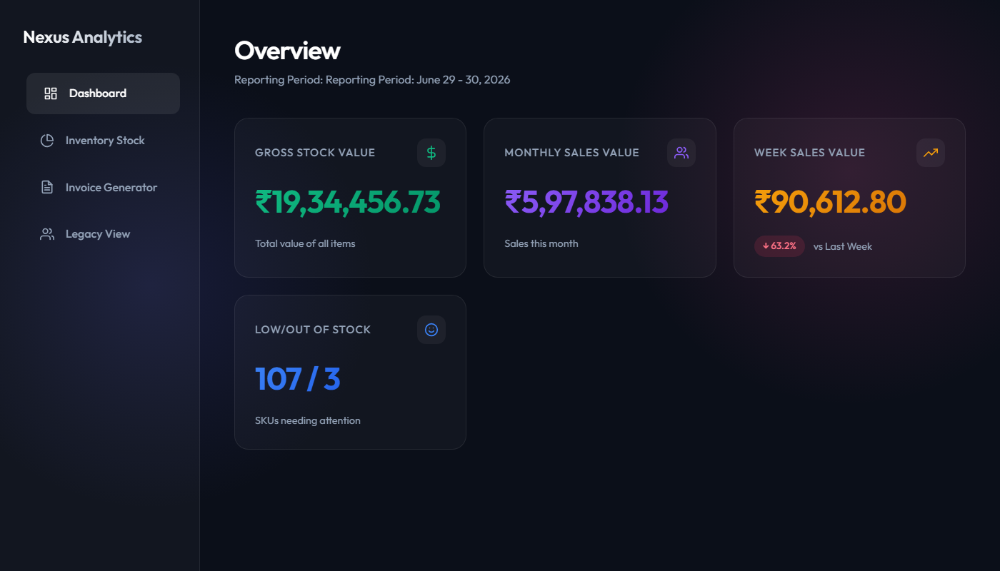
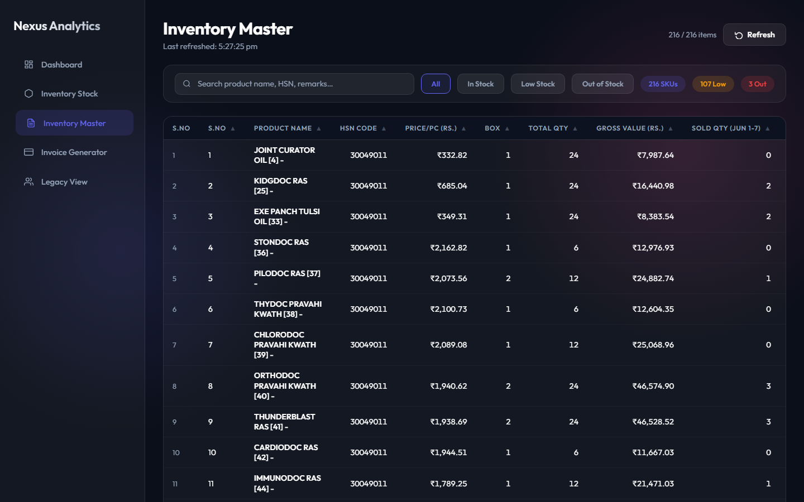
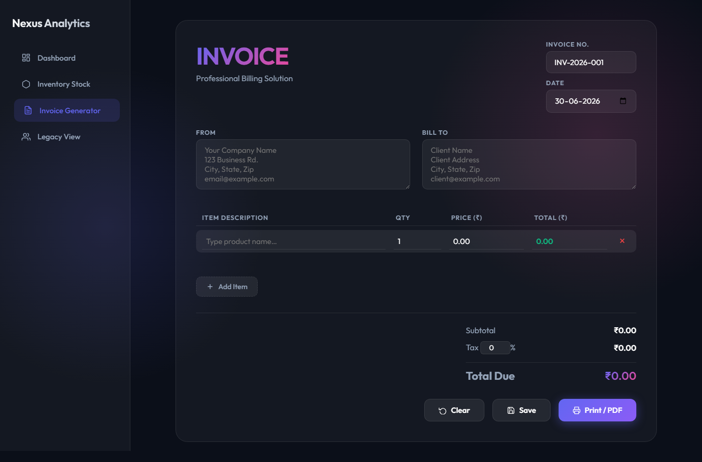
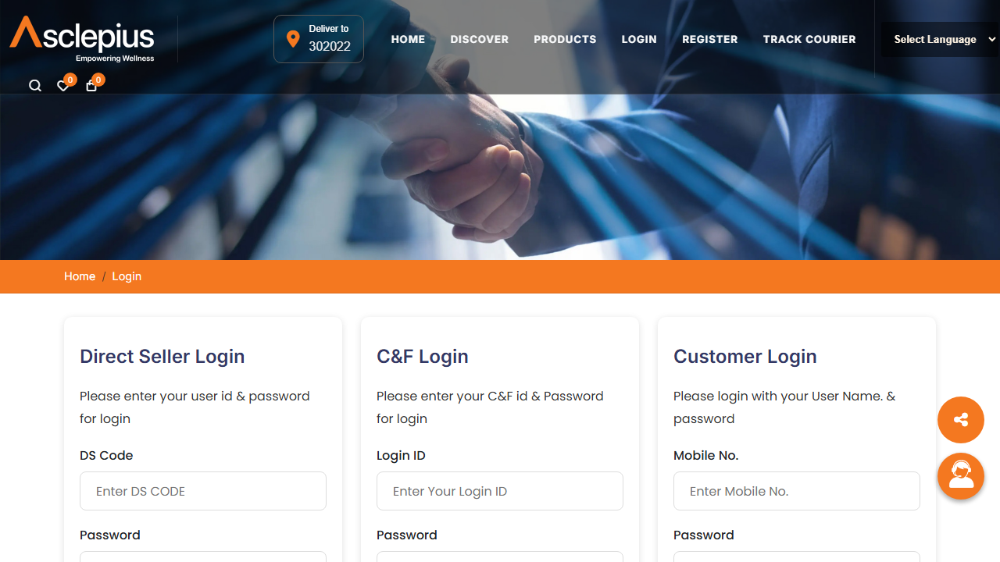
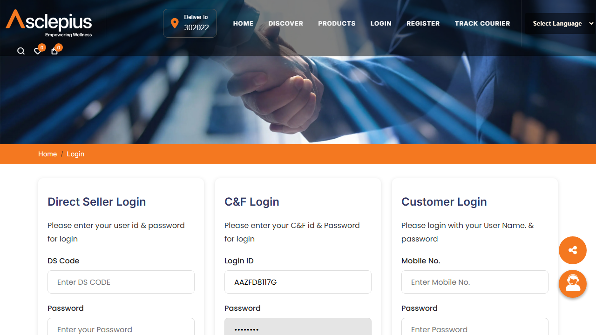
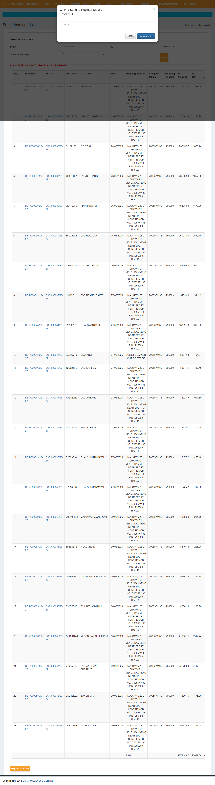
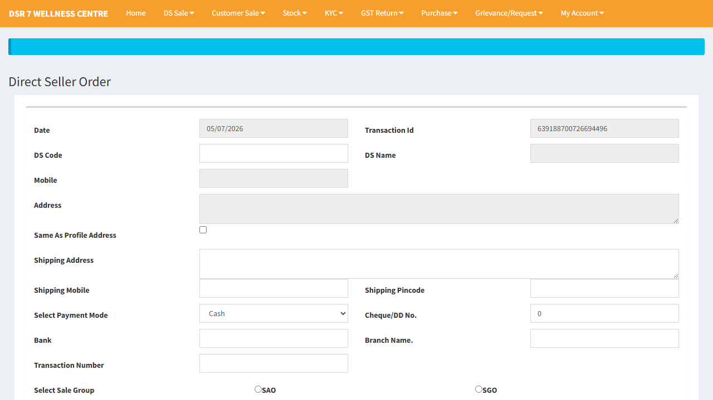
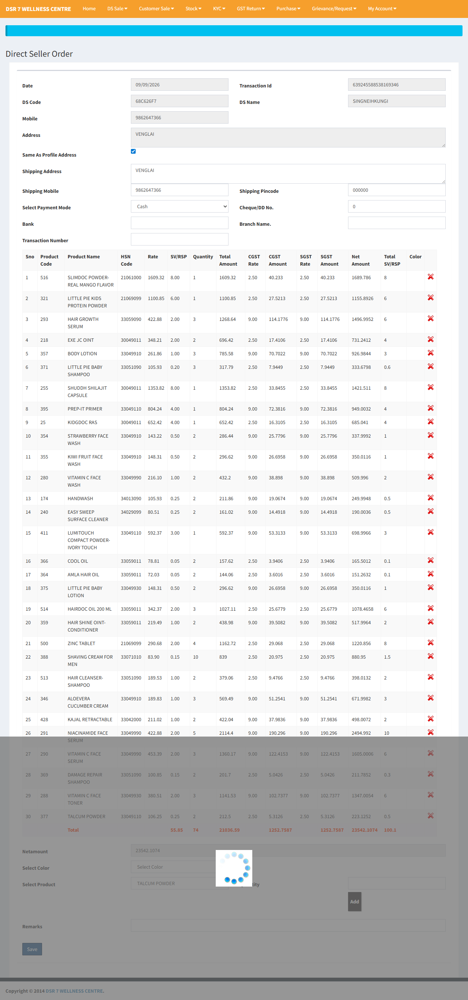

# ⚡ Ledger God Mode Web App

[](https://ledger-web-app.onrender.com/)
[](https://www.python.org/)
[](https://palletsprojects.com/p/flask/)
[](https://playwright.dev/)
[](https://gunicorn.org/)
[](https://www.sqlite.org/)

A real-time distributor ERP covering inventory management, invoice billing, MLM downline crawling, Asclepius portal automation, and bidirectional Google Sheets cloud sync.

## 🌐 Live App

> **[https://ledger-web-app.onrender.com/](https://ledger-web-app.onrender.com/)**

> 📖 **Full deep architecture, data flows, ERD, and sequence diagrams → [`ARCHITECTURE.md`](ARCHITECTURE.md)**

---

## 📸 Screenshots

### 📊 Dashboard


### 📦 Inventory Master


### 🧾 Invoice Billing Terminal


### 🤖 AWPL Portal — Login


### 🤖 AWPL Portal — Order Filled


### 🤖 AWPL Portal — Bill Detail


### 🛒 DS Sale Order


### ✅ Portal Order Submitted (Automated)


---

## 🏗️ System Architecture (Graphify)

```mermaid
graph TB
    subgraph Client_Layer ["🖥️ Client Tier — 11 SPA Pages"]
        UI_Dash["📊 Dashboard"]
        UI_Inv["📦 Inventory"]
        UI_Master["📈 Inventory Master"]
        UI_Invoice["🧾 Billing Terminal"]
        UI_InvHist["📜 Invoice History"]
        UI_PurHist["🚚 Purchase History"]
        UI_Ledger["💰 Ledger Report"]
        UI_Mizoram["🏆 Mizoram Bronze"]
        UI_Disease["🌿 Disease Guide"]
        UI_SPOrder["🛒 Stock Point Order"]
        UI_Portal["🔄 Portal Sync"]
    end

    subgraph Flask_Core ["⚙️ Flask 3.0.3 (app.py · 1373 lines) + Gunicorn 22"]
        Router["REST Router"]
        AutoSync["🔁 AutoSync Daemon\nhourly GSheets\ndaily rollover\n5-min poll"]
        BP["invoice_api.py Blueprint"]
    end

    subgraph Engines ["🧮 Business Logic"]
        InvEng["inventory_engine.py\n5-week dynamic buckets"]
        MonthRoll["monthly_rollover.py\nAuto header rename"]
        DisCache["Disease Guide Cache\nThread-safe singleton"]
        Formulas["update_inventory_formulas()\nGross · Remaining · SP"]
    end

    subgraph CloudSync ["☁️ Google Sheets (gspread 6.2.1)"]
        Restore["restore_gsheets.py\nGSheets → SQLite\n60-sec rate-limit"]
        Push["init_gsheets.py\nSQLite → GSheets\non every mutation"]
    end

    subgraph PortalBots ["🤖 Playwright 1.44 Automation"]
        SaleOrder["portal_submit_order.py\nSAO/SGO order submit"]
        StockBot["submit_stock_order.py\nFranchise restock\n(subprocess 3-min)"]
        DSLookup["ds_lookup_api.py\nLive DS lookup fallback"]
        Ledger["fetch_ledger_report.py\nWallet scrape (Popen)"]
    end

    subgraph Crawlers ["🌲 Downline Crawlers"]
        BFS["Full_Tree_Crawler.py\nAsync BFS from 62C04A\nCSV checkpoint"]
        Parallel["Parallel_Tree_Crawler.py"]
        SGO["SGO_Tree_Crawler.py"]
    end

    subgraph DB ["🗄️ ledger.db (SQLite3)"]
        T1["inventory (220 rows × 30 cols)"]
        T2["invoices (149+ records)"]
        T3["customers (58 DS codes)"]
        T4["mizoram_bronze"]
        T5["kpis · settings · sync_log"]
    end

    subgraph External ["🌐 External"]
        AWPL["asclepiuswellness.com\nASP.NET Portal"]
        GCloud["Google Sheets API v4"]
        Render["Render.com Cloud"]
        Uptime["UptimeRobot\n/ping every 5 min"]
    end

    UI_Dash & UI_Inv & UI_Master & UI_InvHist & UI_PurHist & UI_Ledger & UI_Mizoram & UI_Disease & UI_SPOrder & UI_Portal --> Router
    UI_Invoice --> BP

    Router --> InvEng & MonthRoll & DisCache & Formulas & Restore & Push & StockBot & DSLookup & Ledger
    BP --> InvEng & Formulas & DSLookup & SaleOrder & Push
    AutoSync --> MonthRoll & Restore & Push

    Router & BP & InvEng & MonthRoll & Formulas & Restore & Push --> DB

    SaleOrder & StockBot & DSLookup & Ledger & BFS & Parallel & SGO --> AWPL
    Restore <--> GCloud
    Push --> GCloud
    Uptime -->|GET /ping| Render

    classDef ui fill:#3b82f6,stroke:#1d4ed8,color:#fff;
    classDef server fill:#8b5cf6,stroke:#6d28d9,color:#fff;
    classDef engine fill:#10b981,stroke:#047857,color:#fff;
    classDef cloud fill:#06b6d4,stroke:#0891b2,color:#fff;
    classDef bot fill:#f59e0b,stroke:#d97706,color:#fff;
    classDef db fill:#ef4444,stroke:#b91c1c,color:#fff;
    classDef ext fill:#64748b,stroke:#334155,color:#fff;

    class UI_Dash,UI_Inv,UI_Master,UI_Invoice,UI_InvHist,UI_PurHist,UI_Ledger,UI_Mizoram,UI_Disease,UI_SPOrder,UI_Portal ui;
    class Router,AutoSync,BP server;
    class InvEng,MonthRoll,DisCache,Formulas engine;
    class Restore,Push cloud;
    class SaleOrder,StockBot,DSLookup,Ledger,BFS,Parallel,SGO bot;
    class DB,T1,T2,T3,T4,T5 db;
    class AWPL,GCloud,Render,Uptime ext;
```



---

## 🚀 How It Works — Core Subsystems

### 🧮 1. Dynamic Monthly Inventory Engine (`inventory_engine.py`)
Divides any calendar month into 5 weekly sales buckets and computes for each of 220+ SKUs:

| Formula | Expression |
|---|---|
| Gross Value | `Total Qty × Price/Pc` |
| Remaining Qty | `Total Purchased − Σ Cumulative Sales` |
| Remaining Value | `Remaining Qty × Price/Pc` |
| Sales % | `Sold Qty / Total Qty × 100` |
| Total SP | `Remaining Qty × SP/Pc` |

Data sourced from `purchase_orders.json` (stock in) and `invoices` table (stock out, excluding cancelled).

### 🧾 2. Invoice Billing Terminal (`invoice_api.py` Blueprint)
End-to-end pipeline on every `POST /api/invoice/create`:
1. Duplicate invoice number check
2. **Strict stock policy** — aggregate SKU quantities, compare vs. `c19` (Remaining Qty); block if any item exceeds available stock
3. Atomic DB insert + weekly bucket deduction + formula recalculation + totals resum
4. Background portal order submission (`portal_submit_order.py` — SAO/SGO)
5. Background Google Sheets sync (`init_google_sheets()`)

Invoice cancellation reverses the stock deduction using the same week-column lookup.

### 🔄 3. Monthly Auto-Rollover + Hourly GSheets Sync
Background daemon polls every 5 minutes:
- **Daily**: detects if `Sold Qty (Mon DD-DD)` headers are stale → renames columns, zeroes new-month sold quantities, re-sums TOTAL row
- **Hourly**: bidirectional GSheets sync (pull remarks + push all changes)

### 🤖 4. Portal Robotics (Playwright 1.44)
| Bot | Target Page | Purpose |
|---|---|---|
| `portal_submit_order.py` | `SpdistributorSale.aspx` | Submit SAO/SGO sale order after billing |
| `submit_stock_order.py` | `FranchiseorderN.aspx` | Franchise restock purchase (subprocess, 3-min timeout) |
| `ds_lookup_api.py` | `SpdistributorSale.aspx` | DS customer lookup when not cached in DB |
| `fetch_ledger_report.py` | Portal ledger pages | Scrape wallet transaction statement |

### 🌲 5. Genealogy Downline Crawler (`Full_Tree_Crawler.py`)
Async BFS from root node `62C04A` across both SAO and SGO binary trees. Extracts distributor name, code, rank, left/right SP volume, KYC status. Checkpoints to CSV on every node to enable instant resume.

### 🩺 6. Disease Guide
Thread-safe in-memory cache of 100+ Ayurvedic conditions from `master_review_data_perfected.json`. Sub-millisecond search by condition name or category.

---

## 📱 Page Directory

| Route | Page |
|---|---|
| `/dashboard` | Executive KPI Command Center |
| `/inventory` | Live Stock Manager |
| `/inventory_master` | Month-by-month inventory with weekly buckets |
| `/invoice` | Billing Terminal — DS code lookup, item selection, receipt print |
| `/invoice_history` | Invoice audit trail — filter, dispatch, cancel, remarks |
| `/purchase_history` | Supplier purchase order log |
| `/ledger_report` | Wallet statement — debit/credit/balance |
| `/stock_point_order` | Franchise restock — portal bot submission |
| `/mizoram_bronze` | Leadership rank tracker (Bronze/Silver/Gold/Platinum) |
| `/disease_guide` | Ayurvedic clinical recommendation search |
| `/portal_sync` | Portal sync status and manual trigger |

---

## 🧠 Knowledge Graph (Graphify)

The entire codebase is mapped into a **GraphRAG-ready knowledge graph** — stored in [`graphify-out/`](graphify-out/) and committed to this repo so you always have it, even on a fresh clone.

### 📊 Graph Stats

| Metric | Value |
|---|---|
| **Files mapped** | 286 unique source files |
| **Nodes** | 692 (functions, classes, templates, config) |
| **Edges** | 531 (calls, renders, defines, packages) |
| **Communities** | 270 semantic clusters |
| **Coverage** | All 12 templates · 2 JS files · schema.sql · Dockerfile · all core Python |

### 🗂️ Generated Files

| File | Description | How to Open |
|---|---|---|
| [`graphify-out/graph.html`](graphify-out/graph.html) | Interactive D3 network graph | Open in Chrome / Edge |
| [`graphify-out/GRAPH_TREE.html`](graphify-out/GRAPH_TREE.html) | Collapsible tree hierarchy | Open in Chrome / Edge |
| [`graphify-out/GRAPH_REPORT.md`](graphify-out/GRAPH_REPORT.md) | Architecture report + community breakdown | Any Markdown viewer |
| [`graphify-out/graph.json`](graphify-out/graph.json) | Full GraphRAG-ready dataset | Graph queries / AI tools |

### 🔍 Query Examples

```bash
# Answer a question about how something works
graphify query "How does invoice billing work?" --graph graphify-out/graph.json

# Trace the path between two components
graphify path "dashboard.html" "api_kpi" --graph graphify-out/graph.json
# → dashboard.html --calls_api--> api_kpi()

graphify path "schema.sql" "get_db" --graph graphify-out/graph.json
# → schema.sql --defines_schema_for--> get_db()

# Explain any function or file
graphify explain "restore_from_gsheets" --graph graphify-out/graph.json

# Re-index after editing code (no LLM needed, instant AST)
graphify update .
```

### 🔄 After Cloning

The graph is pre-built and committed — no re-extraction needed. If you edit code:

```bash
graphify update .
```

> `.graphifyignore` is configured to exclude databases, screenshots, and raw data dumps so the graph stays clean and signal-only.

---

## 🛠️ Setup

```bash
git clone https://github.com/roshan-pixel/-ledger_web.git
cd -ledger_web
pip install -r requirements.txt
playwright install chromium
python app.py          # http://localhost:5000
```

### Docker
```bash
docker build -t ledger-web .
docker run -p 5000:5000 ledger-web
```

The Docker image is based on `mcr.microsoft.com/playwright/python:v1.44.0-jammy`, which includes Chromium and all system dependencies.

### Render Deployment
- `render.yaml` configures the build command, start command (`gunicorn --timeout 300 app:app`), and Python 3.11.0.
- Place `credentials.json` under Render Secret Files at `/etc/secrets/credentials.json` to enable Google Sheets sync.
- UptimeRobot monitors `/ping` every 5 minutes to prevent free-tier instance sleep.

---

## 📄 License & Attribution

Built for **Asclepius Wellness distributor operations** by [roshan-pixel](https://github.com/roshan-pixel).
